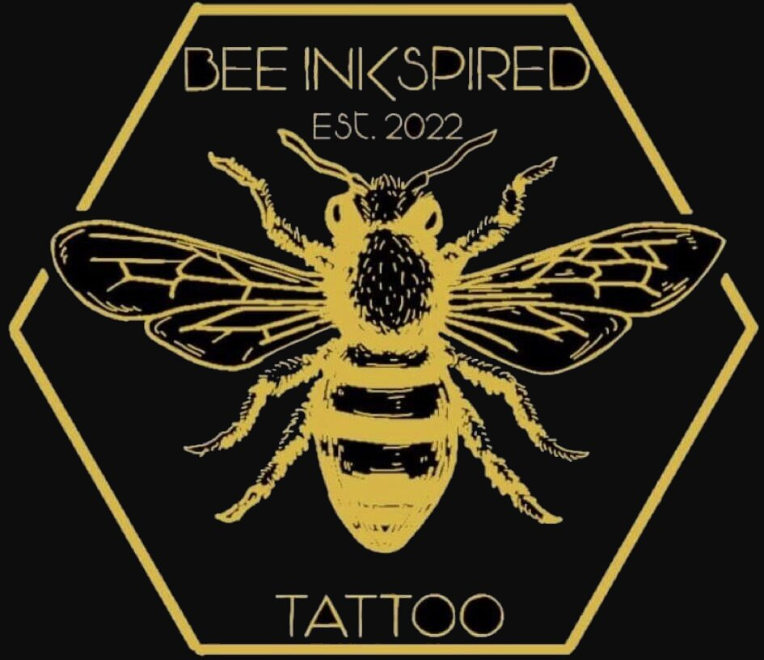

# Bee Inkspired

This site has been created to showcase Oliva Harper's skills, at her Bee Inkspired studio, to entice users to book a flash tattoo or send in a enquiry with reference images for their own design.

## UXD

### Strategy

As a B2C site the final aim is to impress customers to book a tattoo or make an enquiry, this will be done using a gallery showcasing Olivia's abilities. The site needs to be easy to navigate and comprehensive in the information given on Olivia, her skills and the studio. The booking system needs to be straight forward and simple.

### Scope

Features to include:
- Artist information page
- Tattoo gallery 
- Booking section for flash designs
- Password for booking incase user needs to make changes
- Site admin page to view bookings in date order
- Studio information and location 
- Link to social media

### Structure

There will be 5 website pages in total and an admin page:
- Home page
- Artist infomation
- Studio information
- Tattoo FAQ's
- Book or enquire
 
### Skeleton

The home page will be clean with just the logo and a nav bar to direct users to the specific pages listed in the structure above, users can either use the navigation bar to toggle between pages or use the links in the text to redirect them to the booking section. The logo on the navigation will redirect them to the homepage.

### Surface

The site will have a dark theme and font to match the logo. The font will be inported from Google fonts.

### Future features

Features to be added in the future include:
- Image carousel of designs
- Upload image enquiry
- Previous booking section on clients dash with link to leave review
- If admin approves the review will then display on home page 

## Installing

Steps to configure and deploy the application.

- Clone the Repository
- Fork the Repository
- Create Application and Postgres DB on Heroku
- Connect the Heroku app to the GitHub repository
- Final Deployment steps:
    - Set DEBUG flag to False in settings.py
    - Ensure this line exists in settings.py to make summernote work on the deployed environment (CORS security feature): X_FRAME_OPTIONS = 'SAMEORIGIN'
    - Ensure requirements.txt is up to date using the command : pip3 freeze --local > requirements.txt
    - Push files to GitHub
    - In the Heroku Config Vars for the application delete this environment variable : DISABLE_COLLECTSTATIC
    - On the Heroku dashboard go to the Deploy tab for the application and click on deploy branch

## Contributing

A big thank you to [Dennis Ivy](https://www.youtube.com/watch?v=xv_bwpA_aEA&list=PL-51WBLyFTg2vW-_6XBoUpE7vpmoR3ztO) on Youtube for his in depth walk through of a booking project.